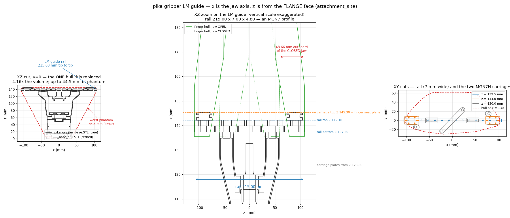
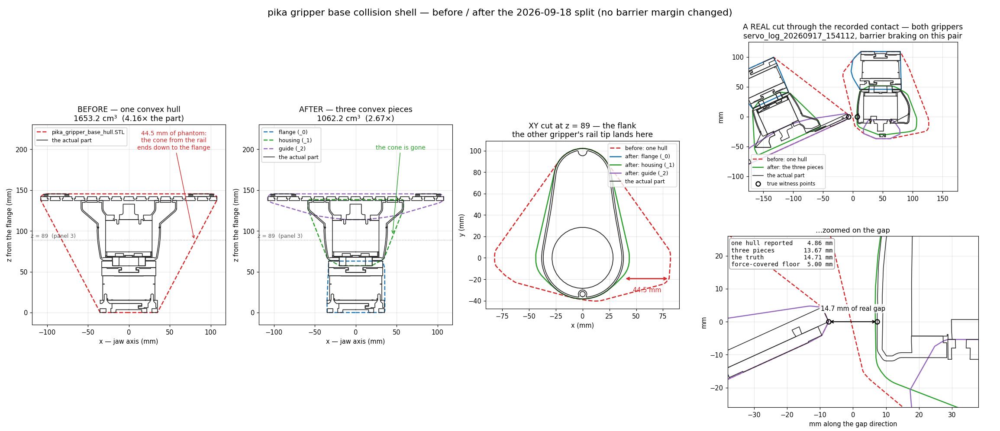

# Pika tool geometry: what 247.642 mm is measured from

`flange -> fingertip = 247.642 mm`, and the F/T sensor is INSIDE that number.

Regenerate with `rb_servo_server/tools/plot_pika_gripper_sections.py`.

## The chain

| from | to | mm | where it lives |
| --- | --- | --- | --- |
| link6 | `attachment_site` | 96.70 | URDF (upstream); link6's visual mesh ends at 96.57, so this frame IS the flange face |
| `attachment_site` | `ft_sensor_base` | 15.0 | `FT_BASE_OFFSET_M` |
| `ft_sensor_base` | `ft_sensor_measurement` | 30.0 | `FT_MEASUREMENT_OFFSET_M` — 45 mm total, matching `force_torque.*.sensor_offset_mm` |
| `attachment_site` | `tcp` | **247.642** | `PIKA_TIP_OFFSET_M` = `pika_gripper.STL` z-max |

The force-control config reaches the same tip by a different route:
`sensor_offset_mm` 45 (flange → sensing reference origin) + `tool_xyz_mm` 202.642
(sensing origin → tip) = 247.642. Its `tool_xyz_mm` is defined FROM THE SENSOR, not
from the flange — the two are consistent, not contradictory.

## The printed PLA+TPU tip (v15, fitted 2026-09-04)

The factory finger (one solid part) was replaced by a two-material printed tip: a black
PLA spine (`PLA_spine_v15.STL`) plus a #F3E600 95A TPU contact blade
(`TPU_blade_v15.stl`, byte-identical to v14). The meshes under
`descriptions/meshes/robots/rb5_850e/visual/tool/` are generated from that CAD by
`rb_servo_server/tools/make_pika_tool_meshes.py`, which carries the transforms; the
display URDF puts a `<material>` on each so the two parts read apart on screen.

### The rest of the tool is coloured off the same Z chain

`pika_gripper_base.STL` is one mesh, so rb_gui used to draw the whole tool in a single
flat grey. The same generator now partitions it BY CONNECTED COMPONENT (not by a cutting
plane — one through Z 45 would slice the sensor's cable connector, which spans Z 18..27
but belongs to the sensor), assigning each part by its area-weighted Z centroid:

| Z (mm from flange) | part | rendered |
| --- | --- | --- |
| 0..15, 45..63 | the two adapter plates that sandwich the sensor — identical face count and volume, i.e. the same part twice | 102/102/102, unchanged |
| 15..45 | RFT64-6A01-A F/T sensor, ending at 45 = `sensor_offset_mm` | 183/183/183 |
| 63..145.3 | gripper housing, plus the rail/carriage plates from Z 123.8 up | 25/25/25 |

The three outputs are an exact partition of the original faces (asserted).
`pika_gripper_base.STL` itself is untouched and is still what the collision hull and the
collision-monitor tests load, so this is a visual change only.

**247.642 mm did not move.** Carriage face -> tip is 102.342 mm on the factory finger
and 102.278 on v15 — 0.064 mm in a 247.642 mm chain. `tcp_joint`, `PIKA_TIP_OFFSET_M`,
`tool_xyz_mm` and `applied_force_mm` are all unchanged, deliberately.

### What DID move: the jaw, by 1.85 mm per side

The printed spine's foot was derived from the pika SENSE arm, not the Gripper finger it
replaces. The M2 hole PATTERN is identical (13.00 x 12.00 at Y +/-6.00) so it bolts on
with no interference — the part just seats further inboard. The carriage is the datum
and it is in the CAD: `pika_gripper_base.STL` carries the carriage top face at URDF
Z 145.30 (= the finger seat plane), the four M2 tapped holes at URDF |X| 82.02 / 95.03,
Y +/-6.00, and the rail screw at |X| 80.01, Y -/+14.55. In the factory finger's tip
frame:

| datum | carriage (CAD) | factory finger | residual | v15 | shift needed |
| --- | --- | --- | --- | --- | --- |
| M2 column A | -35.004 | -35.005 | +0.001 | -37.001 | **+1.996** |
| M2 column B | -48.024 | -48.003 | -0.021 | -49.989 | **+1.986** |
| rail screw | -32.990 | -33.000 | +0.010 | -34.950 | **+1.950** |

The factory finger sits on its own carriage to within 0.021 mm — that agreement is what
validates the coordinate chain. v15 then needs the same shift from three independent
datums, spread 0.046 mm, i.e. below FDM tolerance. This is not new with v15 — every
printed tip since v10 shares that foot.

### And then the caliper said 98 mm

Measured 2026-09-04, full-open gap between the two TPU tip faces: **~98 mm**, and the
jaws close to contact. That is none of the three CAD-pose predictions (90.35 with the
shift above, 94.33 without it, 94.04 for the factory finger), and the reason is a
premise nobody had checked:

> **The vendor's CAD does not draw the fingers at the open stop.** It draws them
> 3.8 mm/side inboard of it.

The old travel constants inherited the same unchecked premise: `0.047` was never
measured, it was picked so that the CAD pose would close to zero gap. So the tracked
numbers are now anchored on the measurement instead —

| | was | now | from |
| --- | --- | --- | --- |
| mesh pose | vendor CAD finger pose | the measured open stop | `MEASURED_OPEN_GAP_MM` |
| carriage stroke | 0.047 m (assumed) | **0.049 m** | gap/2, since gap is 0 at closed |
| tips meet at | 3.7 % (with 3.69 mm of overlap) | **0 %**, no preload | |

`FINGER_TRAVEL_M`, rb_gui's `_GRIPPER_FINGER_TRAVEL_M` and both stack configs'
`gripper_finger_travel_m` must stay equal to that 0.049.

**Do not spend hardware time separating the seating shift from the extra opening.** One
gap measurement cannot: the seating shift `s` and the extra opening `e` only ever appear
as `e - s = 1.83 mm`, so `s = 1.991 / e = 3.83` and `s = 0 / e = 1.83` both reproduce
98.0 mm exactly. Nothing we compute depends on the split — the render, the collision
monitor and the grasp width all consume the measured mapping. `BOLT_DATUM_SHIFT_MM` is
kept only because the generator's carriage datum check uses it.

What would be worth one more caliper reading is **the gap at 50 %**: the linear model
predicts 49.0 mm, which confirms the stroke rather than just its endpoints.

Still owed on hardware: `tool_mass_kg` / `tool_com_mm` are MEASURED values (CM
`ft identify`) and the tip swap changed the mass by tens of grams per side, so re-run
the identification and re-tare. And any grasp width expressed in millimetres (the
overclose command) needs re-deriving: it was scaled through a 94.04 mm full-open model
and the real full scale is 98.0 mm, so the percent a given width maps to moves by
**4.2 %**, not by a fixed offset.

## The LM guide, and why the collision model was wrong there (2026-09-18)

Regenerate with `rb_servo_server/tools/plot_pika_lm_guide.py`.

Sectioning `pika_gripper_base.STL` by connected component isolates the guide as its own
part. **Every number below was confirmed against the hardware by the operator.**

| part | dimensions | position (Z from the flange) |
| --- | --- | --- |
| LM guide rail | **215.00 × 7.00 × 4.80 mm** — an MGN7 profile | Z 137.30..142.10, ends at \|X\| **107.50** |
| carriages ×2 | 30.80 × 17.00 × 6.50 (MGN7H) | Z 138.80..145.30, outer end \|X\| 103.92 |
| carriage plates ×2 | X 17.68..85.02 | Z 123.80..135.50 |
| housing | \|X\| <= 58.46 | Z 63..138 |

**The guide is the only part of the tool with a 107.5 mm radius.** Everything else lives
within ~40 mm of the tool axis, and unlike the fingers the guide does not move: closing
the jaw pulls the fingers in to \|X\| 58.84 while the guide stays at 103.92..107.50, so the
tool's footprint never shrinks. The rail sticks out **48.66 mm per side** beyond every
other part of a closed gripper.

That is why the gripper<->gripper barrier engages there and nowhere else. Replaying the
`q_sent` of the 341 ticks in the 2026-09-17 15:41/16:08 runs where the left<->right
`pika_gripper_base` pair was braking: the two tool origins are **162 mm** apart (TCP to
TCP 145 mm) against a baseline of 354 mm, and 107.5 + 107.5 = 215 > 162, so at the
separation the task needs, the two guides ALWAYS overlap laterally and nothing else ever
does. The rails sit ~85° to each other there, so one gripper's rail tip faces the other's
housing flank.

### The single hull, and the three that replaced it

The monitor checked ONE convex hull of the whole base. That is the worst possible shape
for a single hull: the widest feature (the 215 mm rail, at the top) and the narrowest (the
Ø70 flange, at the bottom) are at opposite ends, so the hull claims the entire cone
between them — **1653.2 cm³ for a 397.7 cm³ part, 4.16x**, median 11.8 mm and up to
**44.5 mm** of phantom, worst on the flanks at Z≈89.

Which is exactly where the guide puts the other gripper's rail tip. Broken down by which
feature is truly closest (`tools/probe_gripper_hull_phantom.py`):

| true witness pair | n | true | one hull reported | phantom | three pieces |
| --- | ---: | ---: | ---: | ---: | ---: |
| housing +y <-> housing +y | 175 | 6.8 mm | 4.5 | 2.3 | 6.8 |
| **LM guide <-> housing flank** | **144** | **13.9 mm** | **4.9** | **8.2** | **12.6** |
| LM guide <-> LM guide | 22 | 8.7 mm | 4.6 | 4.1 | 6.5 |

So the guide-related holds were mostly an artifact: 13.9 mm of real clearance read as
4.9 mm and pinned the pair to the 5 mm force-covered floor. 184 of the 192 sub-5 mm ticks
were truly above it.

`make_pika_tool_meshes.py` now emits the base as **three convex pieces**, split BY
CONNECTED COMPONENT on the base's own structure (never a cutting plane, which would sever
parts — the same rule the visual split follows), and asserts that their union contains
every vertex of the source mesh, so this is a refinement of the old hull and never a hole
in it:

| piece | geometry name | contents | Z |
| --- | --- | --- | --- |
| `pika_gripper_base_hull_flange.STL` | `<prefix>pika_gripper_base_0` | adapters + RFT64 | 0..63 |
| `pika_gripper_base_hull_housing.STL` | `..._base_1` | the housing | 57..138 |
| `pika_gripper_base_hull_guide.STL` | `..._base_2` | plates, rail, carriages | 114..145 |

Regenerate with `rb_servo_server/tools/plot_gripper_hull_before_after.py`. The right-hand
panels are a real cut through one of those recorded contacts, taken on the plane that
passes through both true witness points and contains the gap direction, so the distances
in the picture are the ones the solver measured: **one hull 4.86 mm, three pieces
13.67 mm, truth 14.71 mm**, against a 5 mm force-covered floor.

Result on those same poses: shell 1653.2 → 1062.2 cm³, phantom p50 5.4 → **0.3 mm**,
p95 9.8 → 2.6, max 10.0 → 5.5. Geometry objects 70 → 74, collision pairs 1404 → 1668;
`selfcol_eval_ms` was mean 1.42 / max 3.62 ms against a 50 ms `max_staleness_s`.

**No barrier margin moved.** `d_hard_m`, `d_slow_m` and `gripper_gripper.covered_d_hard_m`
are untouched — the model simply stopped claiming volume the tool does not occupy. Do not
"compensate" for the split by widening a floor. The config key is
`safety.self_collision.mesh.pika_gripper_base_meshes` (a sequence); the old singular
`pika_gripper_base_mesh` is REFUSED at load rather than silently kept, because a config
left on it would quietly restore the fat hull.

### Still open: the carriages are baked at full open

The two MGN7H carriages are inside the STATIC base, frozen at the vendor CAD's full-open
pose (X 73.12..103.92). They physically travel with the fingers, and the moving finger
hull already covers 98.4 % of their volume (max protrusion 1.80 mm), so moving them with
the jaw — or dropping them from the static shell entirely — is worth about 1 mm more and
removes a real lie in the model. Not done: it is a separate change from the hull split.

## Why the picture is here

The sections are the evidence that `pika_gripper.STL`'s origin is the flange and not
the gripper's own mounting face:

- **XY cuts, z = 1..55 mm** — a Ø64 body inside a Ø70 base, on a bolt circle. That is
  the RFT64-6A01-A force/torque sensor, not gripper structure.
- **radius bulges to 60 mm at z = 20..25** — the sensor's cable connector, which the
  controller-manager part file calls out as "protruding past the body dia".
- **the stack ends near z = 45** — exactly `sensor_offset_mm`.

## The mistake this records

On 2026-09-02 the tip offset was briefly changed to 262.642 mm, and `attachment_site`
was briefly moved 15.23 mm off the flange before that. Both came from the same contact
measurement: two hand-parked poses — the TCPs touching the stand, then the two TCPs
touching each other — each read about 15 mm long, and their agreement was taken as
confirmation.

It was not confirmation. The argument at the time was that the two poses' tool axes
were "nearly orthogonal", so a common-mode error could not produce the same
along-the-axis shortfall in both; they are actually 60-67 deg apart. And nothing
verified the premise the whole method rests on — that the FINGERTIP PLANE was the part
making contact. Any other part of the gripper touching first biases the fit long, in
the same direction, in both poses.

Two things caught it. `attachment_site` moving showed up immediately in rb_gui as the
gripper floating 15 mm off the flange, and the meshes agreed: link6 ends at 96.57 mm
where upstream puts the frame at 96.70, and RB3 uses the same convention (link6 ends at
exactly 100.00, where its `attachment_site` sits). Then sectioning the STL settled the
remaining 15 mm outright.

The lesson worth keeping: a contact fit measures the distance to WHATEVER TOUCHED. It
cannot tell you what that was. The CAD could answer this without a robot, and should
have been asked first.
