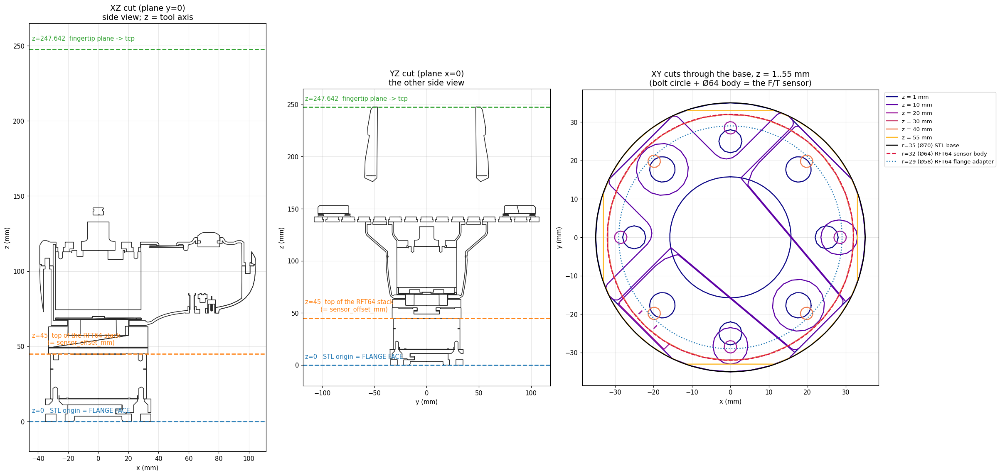

# Pika tool geometry: what 247.642 mm is measured from

`flange -> fingertip = 247.642 mm`, and the F/T sensor is INSIDE that number.

Regenerate with `rb_servo_server/tools/plot_pika_gripper_sections.py`.

## The chain

| from | to | mm | where it lives |
| --- | --- | --- | --- |
| link6 | `attachment_site` | 96.70 | URDF (upstream); link6's visual mesh ends at 96.57, so this frame IS the flange face |
| `attachment_site` | `ft_sensor_base` | 15.0 | `FT_BASE_OFFSET_M` |
| `ft_sensor_base` | `ft_sensor_measurement` | 30.0 | `FT_MEASUREMENT_OFFSET_M` — 45 mm total, matching `force_torque.*.sensor_offset_mm` |
| `attachment_site` | `tcp` | **247.642** | `PIKA_TIP_OFFSET_M` = `pika_gripper.STL` z-max |

The force-control config reaches the same tip by a different route:
`sensor_offset_mm` 45 (flange → sensing reference origin) + `tool_xyz_mm` 202.642
(sensing origin → tip) = 247.642. Its `tool_xyz_mm` is defined FROM THE SENSOR, not
from the flange — the two are consistent, not contradictory.

## Why the picture is here

The sections are the evidence that `pika_gripper.STL`'s origin is the flange and not
the gripper's own mounting face:

- **XY cuts, z = 1..55 mm** — a Ø64 body inside a Ø70 base, on a bolt circle. That is
  the RFT64-6A01-A force/torque sensor, not gripper structure.
- **radius bulges to 60 mm at z = 20..25** — the sensor's cable connector, which the
  controller-manager part file calls out as "protruding past the body dia".
- **the stack ends near z = 45** — exactly `sensor_offset_mm`.

## The mistake this records

On 2026-09-02 the tip offset was briefly changed to 262.642 mm, and `attachment_site`
was briefly moved 15.23 mm off the flange before that. Both came from the same contact
measurement: two hand-parked poses — the TCPs touching the stand, then the two TCPs
touching each other — each read about 15 mm long, and their agreement was taken as
confirmation.

It was not confirmation. The argument at the time was that the two poses' tool axes
were "nearly orthogonal", so a common-mode error could not produce the same
along-the-axis shortfall in both; they are actually 60-67 deg apart. And nothing
verified the premise the whole method rests on — that the FINGERTIP PLANE was the part
making contact. Any other part of the gripper touching first biases the fit long, in
the same direction, in both poses.

Two things caught it. `attachment_site` moving showed up immediately in rb_gui as the
gripper floating 15 mm off the flange, and the meshes agreed: link6 ends at 96.57 mm
where upstream puts the frame at 96.70, and RB3 uses the same convention (link6 ends at
exactly 100.00, where its `attachment_site` sits). Then sectioning the STL settled the
remaining 15 mm outright.

The lesson worth keeping: a contact fit measures the distance to WHATEVER TOUCHED. It
cannot tell you what that was. The CAD could answer this without a robot, and should
have been asked first.
