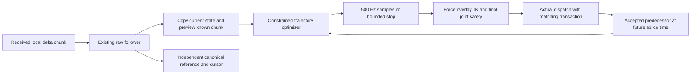

# Constrained preview trajectory execution — 2026-09-06

## Status and scope

The September 6 late-evening repair adds rejection diagnostics, transports
geometry-hold gauge changes through pending plans, and corrects the artificial
1.4/√3 dominant-axis rotation ceiling. Its current validation is recorded under
`outputs/preview_fold_repair_20260906/report.md`: all 58 regression targets pass,
the 49-test analysis suite executes without skips, the exact real-backend build
passes config-only preflight, and all three default fixed-input replays complete.
The rotation replay changes observed QP failures13→0, expiry brakes2→0, and
orientation error p953.634→0.893 degrees. The two original terminal geometry
windows change plan admissions17→63 and0→45, with zero expiry brakes.

Physical validation remains separate. One earlier free-motion interval still
reaches95.68ms backlog under the unchanged100ms cap. Jerk1000 reduces lag/tracking
error but raises3–8Hz nominal band RMS; jerk4000 reaches the backlog cap in that
interval. The production weight stays2000. One1000 replay also exposes timing
sensitivity; all attempts, including that failure, are retained. The detailed
older acceptance section below remains evidence for the pre-repair integration.

The server integration under the explicit `flow_infer_preview` profile has
completed recorded-input replay and clean native integration checks. The exact
real-backend binary has also been built and checked without starting hardware.
The operator command below selects this profile for a supervised physical
comparison. Physical vibration, contact response and task success remain to be
measured. `flow_infer_fresh` continues to select its existing conditioner.

The new path uses an off-servo QP worker and a finite trajectory sampled by the
500 Hz servo. Its pose-output low-pass stage is disabled. Existing force filters
and final joint safety conditioning remain, including the configured pinned-IK
joint filter in limit/relief conditions. The recorded-input improvements below
include the integrated preview coordinator and worker. They are not evidence
that the physical robot has reduced vibration.

The 17:18:47 griponly recording is the comparison input. Its native baseline
reproduces every consumed frame and the raw/stage poses at logged precision.
See [the prior conditioner analysis](follower_output_conditioning.md).

## Separate reference from output



The original follower remains the reference generator. Every new delta frame
anchors at its original sampled state, with the same frame cropping, force gate,
plan clock and fresh replan semantics. The optimized output is never substituted
as the delta integration origin. This prevents output-conditioning error from
silently becoming the next reference. A candidate's changed plan leash can still
change reference progress; the independent leash replay measures that separately.

The preview copies the follower **after** the current live tick. Knot zero is
the current raw sample. Future knots advance only the copy with the currently
known frame and frozen gates. Hypothetical future stalls and lead diagnostics
do not mutate the live follower or cause live faults. The copy never publishes
gripper commands. The existing gripper bridge follows the policy publisher,
independently of the follower's internal gripper cursor.

Reference snapshots carry generation/expiry times and caller-owned revision
identity. A frame replacement invalidates pending worker results; a reset or
authority-changing force/ROI fold changes lifecycle/gate identity. A tagged
geometry-hold fold changes the common coordinate gauge, with the strict
transport rules below. Continuously changing
force magnitude/direction and plan-rate forecasts do not invalidate every
pending result: the current physical force direction is supplied to each
request and checked again at each output sample. This distinction avoids
starving future splices on ordinary sensor noise. Forecast horizon is
different from validity: 240 ms of conditional prediction does not authorize
using a stale snapshot for 240 ms.

## Trajectory optimization

At a proposed splice time, position, velocity and acceleration are fixed to the
previous valid output trajectory evaluated at **that same time**. An offline
cold start explicitly uses the recorded previous emitted pose with zero
derivatives. It is not reconstructed from a future raw state.

The decision variables are piecewise-constant jerk over a finite time grid.
Exact triple-integrator dynamics give piecewise-cubic position and continuous
position/velocity/acceleration. The objective penalizes time-aligned reference
pose error, jerk, and changes between adjacent jerk intervals. Position is in
stand coordinates; orientation is a local SO(3) chart using Eigen/Pinocchio.
There is no output low-pass stage in this candidate.

Velocity, acceleration and jerk limits are constraints, not tuning weights.
For linear motion, the quadratic velocity's Bernstein coefficients and linear
acceleration endpoints bound the entire interval, including between knots.
SO(3) tangent derivative bounds are conservatively reduced to enforce physical
angular norm bounds. These norm bounds are stricter than the legacy per-axis
tangent bounds; results must not attribute that difference solely to smoothing.

The angular velocity and acceleration certificates now constrain the complete
three-component Bernstein controls instead of an inscribed per-axis cube.
With the unchanged physical velocity limit V, the conservative chart
acceleration reserve remains A = alpha_max - V²/2 and chart jerk reserve remains
J = jerk_max - 2.5 V A - 5 V³/6. The existing J/√3 axis jerk box and jerk cost
normalization remain unchanged. This removes the artificial V/√3 dominant-axis
speed ceiling while preserving the physical norm envelopes.

An independent-axis optimum that passes every vector-norm control is accepted.
Otherwise a 3N-variable coupled QP adds supporting planes, retaining up to 32N
planes within one plan. It always rechecks the original norm certificate;
satisfying an outer polytope alone is insufficient. A common positive factor
normalizes H and g without changing objective ratios or its minimizer. The
original iteration/time budget still applies; the method does not promise
convergence of every feasible request before its live splice deadline. At N=24
its four dense angular matrices occupy about 1.62 MB per worker, excluding
solver-internal storage and vectors. All coupled work runs outside the servo.
A general recursive-feasibility guarantee for acceleration after changing the
SO(3) chart has not been established.

Tracking tolerances and excess-error budgets are explicit acceptance settings.
They do not establish collision clearance, contact safety or a globally optimal
trajectory. There is no claim of zero delay, zero vibration and zero path error
simultaneously. In particular, a legitimate model reversal and an unwanted
oscillation can occupy the same frequency band.

The solver validates inputs, bounds working-set iterations and elapsed time,
and checks the candidate before accepting it. A rejected solve preserves the
old trajectory. Sampling outside its time horizon returns failure; it never
silently extrapolates or falls back to the unconditioned raw target. Timing
measurements are empirical, not a worst-case execution-time guarantee.

## Server integration

`LivePreviewExecution` owns the execution cursor, fixed history, active/staged
polynomials, accepted nominal motion state and a separate stop trajectory.
`PreviewExecutionWorker` owns the solver and follower forecast. Its three input
and three result slots have explicit atomic ownership. Servo-side submit/take
and polynomial sampling never wait for the planning worker.

A result must match epoch, authority gate revision, source wire/receive IDs and
predecessor plan ID. Its coordinate gauge must match or pass the validated
geometry-hold transport. It must arrive before its agreed future splice and remain within the
snapshot's original validity. A 240 ms forecast therefore does not authorize
240 ms of stale execution. A source replacement does not instantly jump the
current output; a matching new result splices from the same p/v/a at its agreed
time. Worker failure never falls back to the raw reference.

The `flow_infer_preview` profile is explicit in `stack_real.yaml`. It uses the
existing follower's physical limits, a 10 ms replan period, 10 ms future splice,
50 ms result lifetime and 32-row source bound. The cursor allows at most 100 ms
of lag, with 200 ms catch-up and a maximum reference-time rate of 1.1. These
are reference timing parameters; they do not increase physical velocity caps.
The old output-error-based leash does not alter the new profile's canonical
raw integration clock. Independent safety and force gates still do.

### Current contact and stop behavior

Only this new profile prepares the existing wrench filter and ForceGate before
advancing the canonical follower. The later force composition reuses the same
prepared input exactly once. Existing force constants, tare coverage and fences
are unchanged. The extra QP/output constraint is active only while the existing
stream channel's **sustained-contact classifier is armed**. This uses its
configured pre-deadzone vector filter, arm dwell and release hysteresis. During
that episode, the constraint receives the tick gate and its filtered deadzoned
force direction. This is a new use of the classifier for an additional
constraint; it is not equivalent to `applyStreamTranslation`.

The canonical follower keeps its existing tick force gate during approach,
arming and release. The force overlay and fences remain active. Only the extra
binary velocity constraint is inactive outside an armed episode: applying it
to tiny residual directions and sub-unity gate release tails caused many
unnecessary stops in recorded replay. A gate value of exactly one already
disables the extra constraint; a slowly recovering value such as 0.98 did not.

During an armed episode with reduced translation force authority, the worker constrains closing
velocity in the into-contact normal `n`:
`n · v_output(t) <= max(0, n · v_canonical(t))`. The canonical forecast uses
unretimed wall time and has already applied the force gate; the optimizer does
not multiply by that gate again. Its piecewise-linear 500 Hz velocity authority
includes zero-crossing knots before taking the positive part. Three Bernstein
coefficients certify each quadratic output-velocity interval. Constraint
generation reduces the solver's working set, but acceptance still verifies
every original constraint.
This certificate uses the interpolated velocity metadata; it is not an exact
continuous reconstruction of the canonical Ruckig velocity between servo ticks.

The translation axes share the same quadratic objective. A smaller contact
solve therefore preserves unconstrained tangent optima and solves the normal
coordinate. Its reconstructed trajectory is accepted only after checking all
original stand-axis physical limits and contact rows; if an axis bound fails,
the full coupled solve runs within the same total budget. This is an exact
feasible solution of the original problem, not a rotated-axis limit change.

The current sample is checked against the current gate normal and canonical
velocity as well. A lagged tracking cursor does not grant additional contact
authority. The numerical allowance is the explicitly configured solver
feasibility precision. The previous spatial no-lead candidate was rejected:
a stationary output could become infeasible when the canonical reference
retreated, causing repeated stops and backlog faults in recorded replay.
The velocity rule permits stationary hold and escape from contact. The existing
chunk path gates translation; this integration does not invent a new
torque-derived orientation constraint.

If a plan expires or a current contact check rejects it, an explicit Ruckig stop
starts from the **last successfully dispatched analytical nominal p/v/a**, with
the matching nominal sample timestamp. It never starts from the newly rejected
proposal. Its physical derivative caps are the same as the optimizer's, its
initial derivatives are never clipped, and it can be used as the predecessor
of a later feasible worker plan. A finite stop has a stationary terminal hold.

The angular stop first tries the identity chart basis. If the conservative
axis box rejects an otherwise physically admissible angular seed, it can try
one fixed orthonormal basis aligned from the initial angular velocity. This
changes coordinates only: the same physical norm and per-chart derivative
checks still apply. It does not guarantee a feasible stop for every state
inside the physical angular norm limits; explicit refusal remains possible.

A translational contact stop can retain the existing angular trajectory only
when its plan ID and sampled angular p/v/a match the last accepted dispatch.
That angular certificate keeps its original expiry. Its samples replace only
the unused angular part of the translation-stop helper; sent angular velocity
and acceleration are not zeroed. A worker splice beyond the angular expiry
is refused. At expiry, or when a complete stop is needed, a separate angular
brake starts from the latest actually accepted angular state and timestamp.
This changes composite predecessor identity while preserving the original
translation brake and clock. If angular provenance cannot be established,
the existing full stop is used. Reset and true-fold rules apply to both parts.
The QP receives no extra braking allowance: a new plan can resume only if its
future splice satisfies the source velocity constraint. Rejected plans cannot
renew the stop's origin or extend its deadline.

There is unavoidable stopping displacement when a new contact constraint
conflicts with current velocity/acceleration. This mechanism does not promise
zero penetration or a certified physical stopping distance. The force overlay,
IK, final joint clamps, collision/floor/ROI constraints, lease and fault gates
retain their independent veto. If they reject the stop, or a valid stop cannot
be constructed, the existing hard fault behavior applies. That behavior
suppresses sends and is **not** evidence of bounded commanded deceleration.
For a planned stop followed by a fault, the terminal sample must pass dispatch
before the fault suppresses subsequent sends.

### Dispatch, resets and gripper timing

A transaction travels with the exact target through in-tick or next-tick send.
It contains nominal/composed poses, the analytical motion sample and its gauge.
After dispatch, FK of the accepted/enqueued joint target is checked against the
matching force-composed target using existing IK acceptance bounds. This is
command acceptance, not a robot-controller acknowledgement or a measurement of
physical TCP velocity/acceleration. Ordinary IK residuals and smoothing errors
are not folded into the next raw delta anchor.

Force, ROI/floor and unclassified folds shift the canonical reference and
execution state once and invalidate pending forecasts. A tagged geometry-hold
fold applies the same translation and left rotation to the raw reference,
accepted state, active plan, brake and history. Pending/staged results can be
transported only after their epoch, authority, source and predecessor identity
still match. Their original splice time and expiry are never extended.
Stand-frame linear velocity/acceleration and body-frame angular
velocity/acceleration are preserved; position and orientation receive exactly
the accumulated fold transform. Current contact checks and final geometry
projection still run. A changed source or predecessor cannot be rescued by a
coordinate transform.

Transactions retain their original force composition and cumulative gauge, so a
queued pre-fold sample is not stripped using a later force offset. InitMotion,
Hold, profile changes, coverage loss and faults reset the lifecycle. A cold start requires an explicitly stationary sent
command and a new valid worker result; old pre-Init p/v/a cannot resume.

The current policy runner also includes separate force-tare hardening: before
every intent, an arm with force control enabled must report `bias_valid=true`
and `tare_state=accepted`. Otherwise the policy exits before inference or
publication. Complete both-arm InitMotion/tare before starting the rollout. If
an InitMotion during a rollout invalidates tare, restart the policy command
after accepted tare returns. The native servo's reset/resume tests do not imply
automatic Python-policy resumption through this separate gate.

Policy-side profile selection requires the server's preview capability. New
gripper commands require fresh per-arm `preview_execution` telemetry with
`enabled`, `active` and status `active`; waiting/braking/faulted arms do not
receive new policy gripper commands. TCP frames continue while waiting so the
planner can recover. This does not cancel a previously accepted gripper move
and does not give the independent gripper publisher an exact Cartesian row
cursor. Task-level gripper timing still needs physical assessment.

`preview_execution` state telemetry and matching CSV columns expose status,
sample timestamp, epoch, plan/source IDs, cursor backlog/rate, plan age,
accepted-command residuals, solve time and submit/admit/reject/expiry/contact
counts. UDP adds five latest reason labels and explicit
`diagnostics_detail=summary` / `diagnostics_full_source=servo_csv` markers.
Full CSV rejection diagnostics distinguish worker/QP failure, result admission
refusal, and staged-plan cancellation. The packet retains full canonical
per-arm `cartesian_solve` data and removes the obsolete identical top-level
`last_cartesian_solve` copy. Policy gripper authority fields are unchanged. Worker completion counters
include results that the mailbox later coalesces or drops; observed-result
counters describe only what the servo consumed. Fold cause, exact transform,
booking/application timestamps, cumulative gauge, and plan-admission intervals
separate geometry holds from force contact. `active=false` during a planned stop
even though the servo is still sending bounded stop samples.

### Validation status

Final clean native regression passes **58/58 tests** in 145.15 s, with unchanged
source/header/test/config hashes across the clean build and suite. JSON/CSV
capability, 64-bit ID and state-payload tests pass. Native
stop tests pass, including invalid-state refusal, terminal hold, repeated
calculator reuse and a regression for unused Ruckig velocity-mode position
fields. A production-loop fixture exposed a next-tick-send history bug; the
correction passes both send orders, single-arm and refused-dispatch tests.
It is not evidence of the cause of an earlier physical rollout. The actual
force-covered InitMotion/tare/resume fixture also passes, including stale-frame
inhibition and a fresh epoch on resumption. Policy tests pass **630 cases**, with
three optional recorded-dataset checks skipped because their fixture is absent.

The first asynchronous recorded replay failed early because exact force-gate
changes continuously invalidated plans. The initial no-lead guard was also too
restrictive to use as an immediate hard-fault trigger. Those findings drove the
current constrained-contact/explicit-stop integration. The spatial constraint
then exposed a retreat deadlock in correctly extracted recorded contact. The
velocity-authority version subsequently exposed unnecessary stops during weak
force release tails. Restricting the extra constraint to the existing sustained
contact episode now completes both full recorded streams in a matched ablation.
Position error p95 is 4.54/5.77 mm versus the recorded conditioner's 9.76/9.67 mm;
native IK joint-command 3–8 Hz RMS is 0.667/0.617 of baseline, and 8–20 Hz RMS is
0.207/0.195. Most 0.5–3 Hz motion remains. Peak position/orientation errors are
sometimes worse, and these are commanded trajectories, not measured vibration.
The final production-source replay uses the shared contact selector and strict
unmasked recorded contact metadata. Both arms complete 46,427 active ticks and
980 frames with zero brake, expiry, late-result or fault events; all 8,327
returned QPs per arm solve. Its timestamps and nominal position/quaternion
components exactly match the fully audited comparison at every tick.

The normal real-backend build, config-only preflight and ABI freshness checks
also pass. An earlier test-only mixed-layout binary was diagnosed and removed
by the clean native rebuild. Build-time layout-header hash checks now supplement
mtime checks; diagnostic failures remain in the evidence record. No safety
threshold or test assertion was weakened to obtain the final pass. Detailed
results, remaining tail errors and whole-server replay limits are saved in
`outputs/preview_execution_redesign_20260906/live_integration/integration_report.md`.
Evidence is saved under
`outputs/preview_execution_redesign_20260906/live_integration/` and
`outputs/preview_live_worker_20260906/`. No hardware was run by this task.

## Reproduce the offline build

```bash
cmake -S rb_servo_server -B rb_servo_server/build/preview_live \
  -DCMAKE_BUILD_TYPE=Release \
  -DRB_SERVO_ENABLE_RBPODO=OFF \
  -DPython3_EXECUTABLE="$(pwd)/.venv/bin/python" \
  -DRB_SERVO_ENABLE_PREVIEW_EXECUTION=ON \
  -DRB_SERVO_BUILD_PREVIEW_EXPERIMENTS=ON
cmake --build rb_servo_server/build/preview_live -j2
ctest --test-dir rb_servo_server/build/preview_live --output-on-failure
```

`RB_SERVO_ENABLE_PREVIEW_EXECUTION` now defaults to ON and requires the installed
qpOASES package; it is not fetched implicitly. `tools/build_stack.sh` requests
that flag explicitly. The production core links the tracker/worker when enabled.
A build with the flag OFF rejects a configuration that enables preview execution.
`RB_SERVO_BUILD_PREVIEW_EXPERIMENTS=ON` additionally builds the recorded replay
tools; building those tools does not select a robot profile.

## Operator command after integration qualification

Use the exact real-backend build, not the isolated offline-test executable:

```bash
cd /home/plaif/workspace/robotics_lab
BUILD_JOBS=2 make build
```

Restart the existing stack with `make run`. Complete both-arm InitMotion/tare and confirm accepted
tare before starting policy. In a separate terminal, use:

```bash
cd /home/plaif/workspace/robotics_lab
FLOW_INFER_TICK_PROFILE=1 FLOW_INFER_PYTHON=/home/plaif/workspace/openpi/.venv/bin/python \
FLOW_INFER_CHECKPOINT=openpi://127.0.0.1:8003 FLOW_INFER_ACTION_MODE=anchored \
FLOW_INFER_INCLUDE_DEPTH=0 FLOW_INFER_ACTION_HORIZON=24 FLOW_INFER_STITCH=boundary \
FLOW_INFER_CHUNK_EXECUTE_STEPS=4 FLOW_INFER_CHUNK_OVERLAY_RUNWAY_STEPS=4 FLOW_INFER_SPEED_SCALE=1.0 \
FLOW_INFER_CHUNK_ANCHOR=command FLOW_INFER_CHUNK_CROSSFADE_STEPS=0 \
FLOW_INFER_CHUNK_ACTIVATION_MODE=ready_event \
FLOW_INFER_TCP_TARGET_PROFILE=flow_infer_preview \
FLOW_INFER_VELPROPRIO_SAMPLE=fixed_step FLOW_INFER_VELPROPRIO_SOURCE=servo_command \
FLOW_INFER_TCP_REANCHOR_MODE=last_emitted_continuous \
FLOW_INFER_GRIPPER_PROPRIO_SOURCE=command FLOW_INFER_RTC=0 RB_ALLOW_REAL_GRIPPER=1 \
FLOW_INFER_RTC_NORM_STATS=/home/plaif/workspace/pika_umi_models_v2/boltv2_griponly_40k/39999/assets/plaif/pika_umi_boltv2_train_tcp_anchored_velgrip_k1/norm_stats.json \
./tools/flow_infer_sweep_run.sh boltv2_griponly_40k --proprio-mode velocity_grip
```

The changed selector is `FLOW_INFER_TCP_TARGET_PROFILE=flow_infer_preview`.
The server checks advertised preview capability; no extra runtime activation
flag is required. `servo_command` proprio samples timestamped coordinator
command FK history, not measured robot feedback. Existing camera, gripper and
OpenPI services remain prerequisites. If tare becomes invalid during a rollout,
the current policy exits; after accepted tare returns, launch the command again.

## Historical offline replay interface

The experimental replay requires explicit optimizer parameters, recorded
schema-v2 input and the frozen baseline configuration. It compares fixed
recorded gates and a conservative candidate-output leash. Recorded model
observations, contact, measured feedback and command acceptance remain fixed;
this is not a counterfactual physical rollout or closed-loop model evaluation.
The replay also treats planning as instantaneous on its simulated timeline;
measured solver wall time is reported separately. A production worker must
account for its actual completion time and splice into a future accepted state.

## Historical result of the first offline native comparison

The optimizer completes the recorded dual-arm stream without an output LPF.
An intermediate jerk weight improves fixed-reference tracking and joint-command
band power, but **the current plan-leash integration fails the accumulated-path
criterion**. In the 10 ms replanning experiment its own output leash changes
the right raw reference by about 38 mm p95 compared with the original raw path.
That failed own-output-leash candidate was not promoted to a live profile.

The distinction is structural: fixing the original recorded gates preserves the
raw delta reference exactly, but feeding a different output trajectory back to
the old distance-based plan clock changes how much of each cropped chunk is
consumed before the next arrival. Those phase differences change the next delta
integration anchor. A preview output may also lead the current raw sample, so
an absolute pose separation cannot simply be interpreted as following delay.
The current conservative replay retains the recorded total gate and adds the
candidate leash; it does not reconstruct new contact or model observations.

The next integration design therefore needs one owner of reference progress:

- Preserve the model observation, source row/timestamp and nominal anchor
  provenance independently of the accepted command trajectory. The sender's
  committed row count and the server's physically executed fraction are different
  quantities and must not silently stand in for one another.
- Account for desired progress, permitted progress and the accepted output state
  in one execution controller. A normal smoothing error must remain visible as
  error rather than being folded into the target origin or repeatedly changing
  which model displacement survives a fresh replacement.
- Keep force/safety authority explicit. A blocked path requires bounded pending
  intent and a defined hold/discard policy, with source identity recorded; merely
  disabling the old leash is not an accepted production replacement.
- Make any path retiming visible to both arms and the gripper scheduler. The
  current independent publisher gripper path does not inherit a new Cartesian
  progress variable automatically.

The completed prototype isolates the useful smoothing mechanism from these
remaining integration problems. Full candidate tables, native joint audit,
test results and frozen configuration hashes are recorded under
`outputs/preview_execution_redesign_20260906/`.

## Independent execution cursor proof of concept

`--execution-cursor PHASE.json` adds an offline alternative to the failed
own-stage-leash experiment. The canonical follower still receives the recorded
gates and incoming frames, so its entire pose/derivative/phase sequence is
unchanged. A separate bounded cursor chooses the reference time followed by the
output optimizer. Its history contains only already observed canonical samples;
future samples come only from a copy of the current known frame. The optimizer
does not see later incoming chunks.

The cursor projects output separation onto the local canonical velocity and
slows only for positive lag. Lead and cross-track error remain separate
diagnostics. This local projection is not a general global closest-path solver
and does not replace geometric or contact safety. Catch-up is rate-bounded and
ends at canonical wall time, including in future reference queries. Exceeding
the explicit backlog bound aborts replay; the code never silently moves the
target origin, clips the cursor delay or extrapolates missing history.

The first explicit experiment uses a 100 ms backlog bound, 200 ms catch-up
time constant and maximum reference-time rate 1.1, while retaining the same
physical QP motion caps. Both arms complete 46,427 ticks and 9,286 accepted
replans. Canonical reference displacement is exactly zero. Position error p95
against the **original current-time raw reference**, not merely the delayed
cursor reference, is 4.06/5.08 mm. Maximum cursor backlog is 1.63/44.51 ms,
and p99 backlog is 0.124/2.59 ms. Some peak errors remain worse than baseline;
full joint and tail comparisons belong to the evidence report.

The original recording's safety plan gate is 1 on every active tick; its total
gate reductions are attributable to the old conditioner leash. This is
verifiable in the original CSV/Feather even though the compact replay-v2 schema
contains only the total gate. Keeping that recorded gate defines a common
reference for this structural experiment; it does not identify the safety gate
that a changed physical rollout would produce.

This cursor removes the demonstrated output-error-to-delta-anchor feedback in
the offline experiment. Its subsequent production integration is described
above and requires separate qualification. Historical reference samples do not
inherit a newly closed current force gate, and retiming does not automatically
retime the independent gripper publisher. Offline replay statistics must not be
reported as integrated-controller or physical-rollout acceptance.

## Method references

The existing raw generator uses [Ruckig's arbitrary-state jerk-limited online
trajectory generation](https://arxiv.org/abs/2105.04830). The experiment adds a
finite-horizon tracking objective around that reference; it does not claim that
Ruckig's time-optimal endpoint solution minimizes vibration. Separating path
error and progress is also established in [model predictive contouring
control](https://doi.org/10.1080/00207179.2013.770170). The current prototype fixes
reference timestamps and does not yet optimize path progress as an MPCC state.
