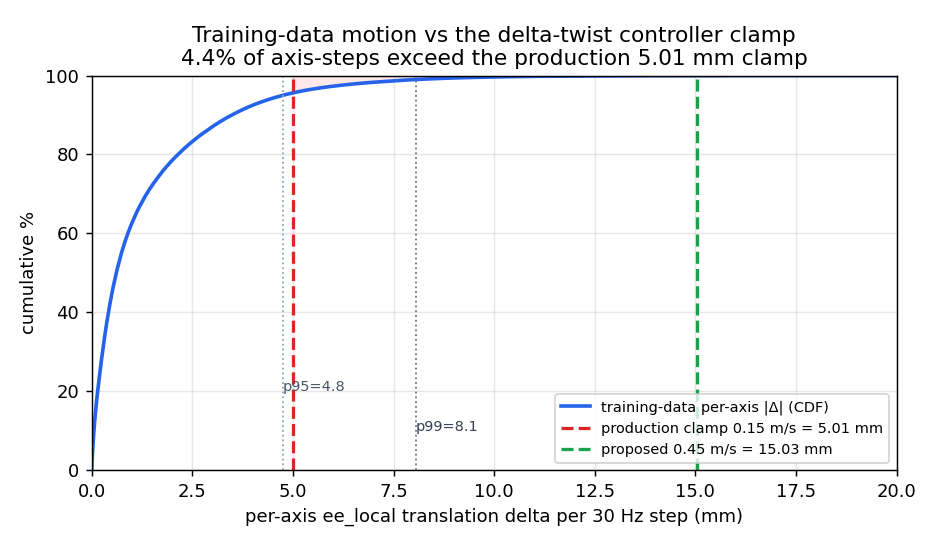
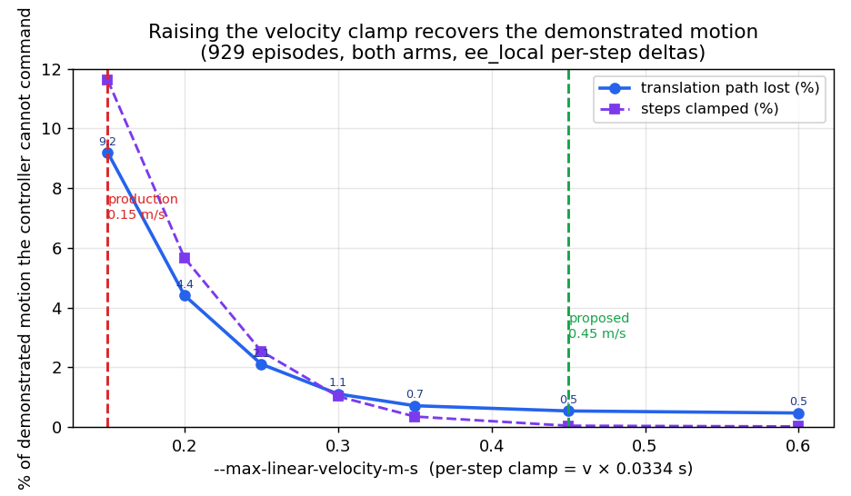
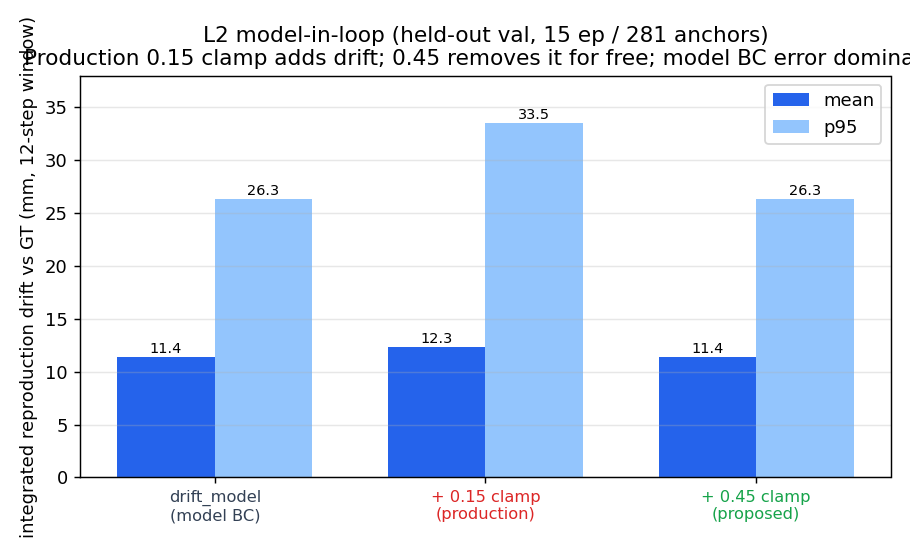

# flow-infer delta-twist 컨트롤러 ↔ 학습 데이터 간극 분석

**날짜:** 2026-07-13 · **범위:** 하드웨어(로봇/VM) 없이 오프라인 검증 · **대상:** `flow-infer`의 ee_local delta-twist 컨트롤러가 학습 에피소드의 입출력을 재현할 수 있는가

> 요약(TL;DR): 컨트롤러의 **표현(representation)은 수학적으로 무손실**이라 데이터를 담을 수 있다. 실제 간극은 두 곳에서 온다 — (1) production의 **속도 클램프(분석 시점 0.15 m/s)가 하드코딩**되어 데모/모델 모션의 빠른 구간을 잘라내고(공짜로 고칠 수 있음), (2) **지배적 재현 격차는 모델의 BC 오차**(~수십 mm/청크)로, 이는 컨트롤러가 아니라 모델 쪽 문제다 — CLAUDE.md의 *"task success is the remaining model-side gap, not runtime"* 를 실측으로 확인한다.

> **적용 노트 (2026-07-13):** 층② 권고를 반영해 `policy_runner/policy_runner/main.py`의 `--max-linear-velocity-m-s` 기본값을 **0.15 → 0.45**로 변경함(각속도 2.0 유지). 이는 flow-infer(클라이언트) 파라미터이며, `--max-linear-velocity-m-s`를 명시하지 않는 실행(`tools/flow_infer_real_policy.sh` 등)에 적용된다 — **openpi 서버 재시작 불필요, flow-infer 재기동 시 발효.** 아래 본문의 "0.15"는 분석 당시 값 기준이다.

---

## 1. 대상 시스템

### 1.1 컨트롤러 = ee_local delta-twist 적분기

`flow-infer`가 정책의 출력 청크(ee_local body-frame twist)를 절대 `TcpPoseTarget`으로 바꾸는 컨트롤러는 서로 **역함수**인 두 연산이 핵심이다 (`policy_runner/policy_runner/flow_dataset.py`):

- **인코드(학습 시)** `pose_delta_local(prev, next)` → 6D twist `[dx,dy,dz, drx,dry,drz]`
  - `translation = q_prev⁻¹·(p_next − p_prev)`, `rotvec = log(q_prev⁻¹·q_next)`
- **디코드(추론 시)** `pose_compose_local(anchor, delta)` → 다음 절대 pose (인코드의 정확한 역)
  - `p = p_anchor + q_anchor·delta[:3]`, `q = normalize(q_anchor·exp(delta[3:6]))`

여기에 런타임 컨디셔닝이 얹힌다 (`flow_inference.py`): `r_align`(pika-tip↔RB-TCP 축 재라벨) → **속도·dt 클램프** → chunk crossfade(2스텝) → **chunk 경계마다 재앵커링** → 500 Hz **FOH SE(3) 보간**.

### 1.2 학습 데이터

- 위치: 스토리지 `/data/pika/bolt` — **930개 에피소드** (pika UMI bimanual, `pose_frame=steamvr_world`, 30 Hz).
- 스키마: 팔당 `pose(T,7)`, `action(T,8)`(=절대 pose7+gripper; `action[t]==pose[t]`), `gripper(T,2)`, `realsense_color/depth`.
- 학습 시 `convert_pika_umi_storage_video.py`가 연속 pose를 **ee_local per-step delta**(위 인코드)로 변환. 즉 컨트롤러의 디코드와 정확히 짝을 이룬다.

### 1.3 배포 모델 (라이브 :8000)

`serve_policy.py --policy.config pi05_pika_umi_video_tcp_gripabs_velproprio_depth_z50_h24 --policy.dir /home/plaif/pika_umi_models_v2/depth_z50_real/65000` — action_horizon 24, velproprio(12D) + depth(z_near 50, z_far 700). 실행 파라미터: `CHUNK_EXECUTE_STEPS=12`, `CHUNK_ANCHOR=command`, `SPEED_SCALE=1.0`, `--max-linear-velocity` 미전달.

---

## 2. 간극 분석 — 3개 층

### 층 ① 표현: 무손실 (컨트롤러는 데이터를 담을 수 있다)

929개 에피소드의 pose 시퀀스를 인코드→디코드 왕복시킨 재현 오차:

| 지표 | 값 |
|---|---|
| 위치 오차 (max, 929 ep) | **0.0000 mm** |
| 회전 오차 (max) | **0.000°** |

`pose_delta_local`↔`pose_compose_local`은 수치적으로 정확한 역함수다. ee_local 표현은 절대 프레임에 불변이므로(steamvr_world이든 stand이든) **원리적으로 데이터를 완벽히 재현**한다. → *컨트롤러 자체는 데이터를 담아낼 수 있다.*

### 층 ② 속도 클램프: 데모 모션을 잘라냄 (하드코딩 결함, 공짜로 수정 가능)

production 실행은 `--max-linear-velocity`를 넘기지 않아 per-step 클램프 = **0.15 m/s × 0.0334 s = 5.01 mm/축**. 이것이 **stats 유도가 아니라 하드코딩 기본값**임이 코드로 확정된다:

1. **로직/문서 버그** — `main.py`의 argparse 기본값이 `None`이 아닌 리터럴 `0.15`. help("생략 시 체크포인트 stats 사용")과 모순이며, `_resolve_velocity_limit_from_stats`가 `if configured is not None: return`으로 즉시 단락.
2. **openpi 원격엔 stats 없음** — `main.py:1910`에서 `openpi://`는 `dataset_stats=None`, `OpenpiRemoteActionSource.stats={}` (base `__init__` 생략)라 stats 경로 자체가 없음.

**데이터/모델 모두 이 클램프를 초과한다:**



- 학습 데이터 축당 ee_local 병진 delta: p95 **4.75 mm**, p99 **8.06 mm**, (글리치 제외) max ~16 mm.
- 라이브 모델 자체 `norm_stats` action q99: 좌/우 y·z축 **7.7–8.7 mm** → **6개 병진축 중 4개가 5.01 mm 클램프 초과**.
- 전체 데이터 replay(929 ep): **스텝의 11.6%가 클램프**되고, **병진 경로의 9.2%를 명령조차 못 함**(최악 66%).

**개선:** 속도 제한만 데이터 분포에 맞추면(회전 2.0 rad/s는 이미 충분) 간극이 사라진다:



| `--max-linear-velocity` | 스텝 클램프% | 경로 손실% |
|---|---|---|
| **0.15 (현 배포)** | 11.6 | 9.19 |
| 0.30 | 1.0 | 1.11 |
| **0.45 (권장)** | 0.0 | 0.54 |

0.45 m/s에서 잔여 0.54%는 SteamVR 트래킹 글리치(259 mm/스텝 = 7.78 m/s, 물리적 불가능)로, **클램프가 막는 게 맞다**. → 상한 클램프는 유지하되 실제 모션을 자르지 않도록 제한을 올리는 것이 옳다.

### 층 ③ 모델 BC 오차: 지배적 재현 격차 (컨트롤러 아님)

라이브 :8000 엔드포인트에 녹화 관측(realsense RGB + depth z50 + velproprio, tcp retarget)을 그대로 넣어 모델 출력 청크를 GT와 비교. **production 파라미터**(실행 윈도우 12스텝, chain/command 앵커).

표본: **held-out val 15 에피소드 / 281 anchor** (라이브 :8000, `pika_umi_video_gripabs_split.json`의 val에서 세션 전반 spread). 실행 윈도우 12스텝(=`CHUNK_EXECUTE_STEPS`, 재계획 전 실제 실행분).

| 지표 (실행 윈도우 12스텝, 양팔, mm) | 값 |
|---|---|
| action MSE (act std 정규화) | mean 0.73 |
| **drift_model** (모델 BC 오차, 적분) | **mean 11.4** / p95 26.3 |
| drift + 0.15 클램프 (현 배포) | mean 12.3 / p95 33.5 |
| drift + 0.45 클램프 | mean 11.4 / p95 26.3 (raw와 동일) |
| **클램프가 추가하는 drift** | mean **+0.9** / p95 **+6.3** / worst +45.5 — 악화 **10.9%** vs 개선 3.9% |
| 모델 출력이 0.15 클램프에 잘림 / 0.45에 잘림 | **4.9% / 0%** |



**해석:** 실제 배포 모델은 원본 데모보다 다소 부드러운 delta를 내지만, held-out val + production 파라미터에서 **클램프는 순부정**이다 — 앵커의 10.9%를 악화(vs 개선 3.9%)시키며 평균 +0.9 mm / p95 +6.3 mm의 drift를 더하고 모델 출력의 4.9%를 자른다. **0.45 m/s로 올리면 이 손실이 공짜로 사라진다**(잘림 0%, drift = raw). 그럼에도 **지배적 재현 격차는 모델 자신의 BC 오차**(mean 11.4 mm / 12스텝)이며, 이는 컨트롤러/런타임이 아니라 모델 쪽이다.

---

## 3. 결론과 권고

**"delta-twist 컨트롤러가 학습 데이터 I/O를 담아낼 수 있는가?"** → **표현상 예, 완벽히.** 실제 간극은:

| 층 | 원인 | 크기 | 조치 |
|---|---|---|---|
| ① 표현 | — | 0 mm | 없음 (무손실) |
| ② 속도 클램프 | 하드코딩 0.15 (stats 유도 아님) | 경로 9.2% 손실 / 스텝 11.6% 클램프 | **`--max-linear-velocity-m-s 0.45`** (즉시, 저위험, 공짜) 또는 argparse 기본값 `None`화 + openpi 경로에 percentile plumbing |
| ③ 모델 BC | 모델 action 예측 정확도 | ~수십 mm/청크 (지배적) | 모델 쪽 작업 (데이터/학습/앙상블); 컨트롤러 튜닝으로 안 풀림 |

**즉시 적용 (컨트롤러):** `tools/flow_infer_real_policy.sh`에 `--max-linear-velocity-m-s 0.45` 추가(각속도 2.0 유지). SteamVR 글리치 차단용 상한 클램프는 유지. → 빠른-구간 간섭 제거. **단 task 성능은 이걸로 안 풀림.**

**실제 지렛대 (모델):** 재현 격차의 대부분이 모델 BC 오차. 여기서부터는 데이터 정제/추가 데모/action horizon·앙상블/학습 개선이 우선. 층별 회귀추적은 아래 도구로.

---

## 4. 재현 방법 (남긴 도구)

- **`scripts/offline_controller_replay.py`** — 로봇 없이 녹화 에피소드를 실제 컨트롤러 수학(clamp/crossfade/재앵커)에 통과시켜 재현 충실도를 회귀검증. 예:
  ```bash
  python3 scripts/offline_controller_replay.py --npz-dir <pose_npz_dir> --chunk 12 --max-lin-vel 0.15   # 현 배포
  python3 scripts/offline_controller_replay.py --npz-dir <pose_npz_dir> --chunk 12 --max-lin-vel 0.45   # 개선안
  ```
- **L2 model-in-loop 드라이버** (scratchpad) — openpi `convert_pika_umi_storage_video.py`의 관측 조립을 재사용해 라이브 :8000으로 모델+컨트롤러 재현을 검증. 더 큰 표본이 필요하면 openpi의 `examples/pika_umi/eval_pika_umi_val_tcp_lerobot.py`를 val 전체에 실행.

**정직한 경계 (오프라인으로 못 잡는 것):** `r_align`이 실제 로봇 body 축과 맞는지(측정 hand-eye/로봇 필요), servo 추종 지연, 접촉 동역학. 단 데이터가 전부 pika 프레임이라 **pika-프레임 재현 충실도**는 완전히 오프라인으로 검증된다.
