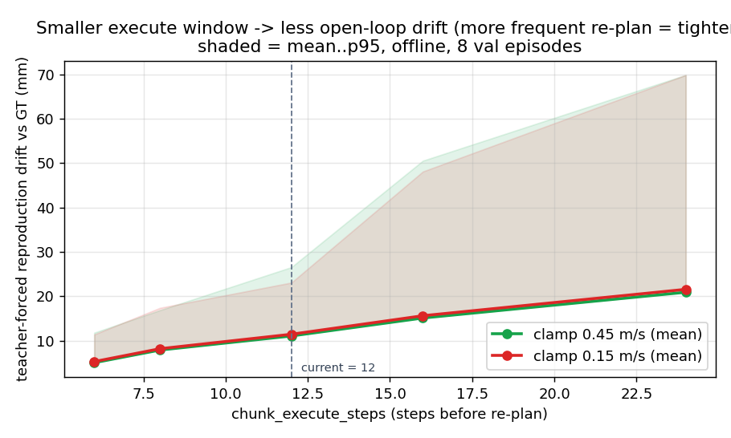

# flow-infer 런타임 파라미터 — 고정 vs 실험 대상 (파라미터 서치 가이드)

**날짜:** 2026-07-13 · **대상 실행:** `pi05_pika_umi_video_tcp_gripabs_velproprio_depth_z50_h24` (라이브 :8000) + `tools/flow_infer_real_policy.sh` · **범위:** 현재 실행 커맨드의 각 파라미터를 "고정(모델이 결정)"과 "실험 대상(서치 가능)"으로 분류

> **핵심 원칙 2가지**
> 1. **모델이 결정하는 값은 고정** — action horizon, proprio 표현, depth 정규화는 서빙 체크포인트가 학습된 방식이라 바꾸면 입력이 분포 밖(OOD)이 되어 모델이 망가진다. 서치 대상이 아니라 "일치시켜야 하는" 값이다.
> 2. **재현 격차의 대부분은 모델 BC 오차**(런타임 아님, 별도 리포트 참조). 따라서 런타임 knob 서치는 대체로 **부드러움·지연·재현충실도**를 개선한다. **유일한 예외는 velproprio**로, 런타임 knob 중 홀로 *모델의 입력*을 바꿔 모델 출력 품질(=지배적 항)에 영향을 준다 → 서치 최우선.

---

## 0. 현재 실행 커맨드 (참조)

```bash
OPENPI_REMOTE_SKIP_WARMUP=1 FLOW_INFER_PYTHON=/home/plaif/openpi/.venv/bin/python \
FLOW_INFER_PRINT_CHUNK=0 FLOW_INFER_ACTION_HORIZON=24 FLOW_INFER_STITCH=boundary \
FLOW_INFER_CHUNK_EXECUTE_STEPS=12 FLOW_INFER_CHUNK_OVERLAY_RUNWAY_STEPS=4 \
FLOW_INFER_SPEED_SCALE=1.0 FLOW_INFER_CHUNK_ANCHOR=command \
FLOW_INFER_VELPROPRIO_SAMPLE=camera_frame FLOW_INFER_VELPROPRIO_SOURCE=measured \
RB_ALLOW_REAL_GRIPPER=1 \
./tools/flow_infer_real_policy.sh \
  --proprio-mode velocity --depth-z-near-mm 50 --depth-z-far-mm 700 --depth-units-m 1e-4
```

파이프라인상 각 파라미터가 작동하는 위치:

```
 openpi 서버(:8000)                     flow-infer (클라이언트)
 ┌─ 고정: action_horizon, proprio       ┌─ 모델입력: velproprio_sample/source
 │        형식, depth 정규화 ─────┐      │
 │  (raw delta chunk 24×14) ──────┼──▶ ─┤─ 컨트롤러: chunk_execute, anchor,
 └────────────────────────────────┘     │            stitch, crossfade, clamp,
                                         │            reanchor/blend, speed_scale
                                         └──▶ pose_compose_local 적분 → TcpPoseTarget
```

---

## 1. 🔒 고정 (FIXED) — 모델이 결정, 서치 대상 아님

바꾸면 모델 입력이 분포 밖으로 나가 출력이 망가진다. "실험"이 아니라 "학습과 일치"시켜야 하는 값.

| 파라미터 (env → CLI) | 현재 값 | 왜 고정인가 |
|---|---|---|
| `ACTION_HORIZON=24` → `--action-horizon` | 24 | 서빙 체크포인트 `h24` = 서버 메타 `action_horizon:24`. 불일치 시 청크 소비가 어긋남 |
| `--proprio-mode velocity` | velocity(12D) | 체크포인트가 **velproprio**로 학습됨. 다른 모드는 state 차원/의미가 달라 OOD |
| `--depth-z-near-mm 50` | 50 | 학습 depth 정규화 `z50`. `_depth_to_image`가 bit-identical해야 depth 채널이 in-distribution |
| `--depth-z-far-mm 700` | 700 | 위와 동일 (클립 상한) |
| `--depth-units-m 1e-4` | 1e-4 | D405 저장 depth의 count→m 환산. 틀리면 깊이 스케일 왜곡 |
| (프롬프트) | 학습 문장 고정 | 모델이 prompt-conditioned. 프롬프트 변형은 **모델 쪽 실험**(런타임 서치 아님) |

> 요컨대 A그룹은 "서버가 무엇으로 학습됐나"에 종속. 서버(체크포인트)를 바꾸지 않는 한 이 값들은 **손대지 말 것**.

---

## 2. 🧪 실험 대상 (SEARCH TARGETS)

### 2-B. 모델 입력 구성 — 최우선 (런타임 중 유일하게 모델 출력에 영향)

velproprio는 모델이 보는 **현재 속도 상태**를 어떻게 만드느냐다. 학습 분포에 가장 잘 맞는 구성을 찾으면 **모델 BC 오차(지배적 항)**를 직접 낮출 수 있다.

| 파라미터 | choices | 스크립트 값 | 오프라인 서치 | 최적화 지표 |
|---|---|---|---|---|
| `VELPROPRIO_SAMPLE` → `--velproprio-sample-mode` | `replan` \| `fixed_step` \| `camera_frame` | camera_frame | ✓ L2(:8000) | 모델 BC 오차↓, 출력 delta의 in-distribution |
| `VELPROPRIO_SOURCE` → `--velproprio-source` | `measured` \| `command` | measured | ✓ L2(:8000) | 위와 동일 |

→ 2×2 = **4 조합**을 L2 드라이버로 :8000에 통과시켜 BC 오차 + norm_stats 분포 적합도로 랭킹 가능.

### 2-C. 컨트롤러 적분 / 스티칭 — 오프라인 서치 가능 (부드러움·지연·재현충실도)

모델 출력(delta chunk)을 절대 pose로 적분하는 방식. task 성공보다 **매끄러움/지연/재현충실도**에 영향.

| 파라미터 | choices/범위 | 스크립트 값 | 오프라인 서치 | 최적화 대상 | 비고 |
|---|---|---|---|---|---|
| `CHUNK_EXECUTE_STEPS` → `--chunk-execute-steps` | 1–24 | 12 | ✓ | open-loop drift↓ ↔ 추론부하 | 작을수록 반응적(drift↓), 클수록 매끄럽지만 drift↑ |
| `CHUNK_ANCHOR` → `--chunk-anchor-source` | `actual`\|`command`\|`chain` | command | △ | 재앵커 보정 방식 | **actual/measured 계열은 실제 FK 필요** → 오프라인은 command/chain만 충실 |
| `STITCH` → `--chunk-stitch-mode` (+`ENSEMBLE_PERIOD`=6, `ENSEMBLE_BLEND`=linear\|none) | `boundary`\|`ensemble` | boundary | ✓ | BC 노이즈 스무딩/지터↓ | ensemble = 겹치는 청크 평균 |
| `CHUNK_CROSSFADE_STEPS` → `--chunk-crossfade-steps` | 0–N | 2 | ✓ | 경계 속도 불연속↓ | |
| `TCP_REANCHOR_MODE` → `--tcp-target-pose-reanchor-mode` | `measured_legacy`\|`last_emitted_continuous`\|`measured_blend` | measured_blend | △ | 재앵커 스무딩 | measured 계열은 실측 필요 |
| `TCP_BLEND_STEPS` → `--tcp-target-pose-blend-steps` | 0–N | 8 | △ | 재앵커 블렌드 길이 | |
| `--tcp-target-pose-conditioning` | `legacy_step_hold`\|`foh_se3` | foh_se3 | ✓ | 500Hz 보간 방식 | |
| `--max-linear-velocity-m-s` / `--max-angular-velocity-rad-s` | — | **0.45**(변경됨) / 2.0 | ✓ **완료** | 클램프 손실↓ | 별도 리포트에서 서치·적용 완료 |

### 2-D. 실행 속도 — 오프라인 부분검증 + 로봇 필요

| 파라미터 | 범위 | 값 | 오프라인 | 비고 |
|---|---|---|---|---|
| `SPEED_SCALE` → `--speed-scale` | >0 | 1.0 | △ | policy_dt·클램프 스케일. **접촉 타이밍은 로봇 필요** |

### 2-E. RTC (real-time chunking) — 현재 OFF, 켜면 별도 서치 축

| 파라미터 | 값 | 오프라인 | 비고 |
|---|---|---|---|
| `FLOW_INFER_RTC=1` + `PREFETCH_AT`/`RTC_DELAY`/`RTC_SCHEDULE`(exp) | 현재 미설정(=off) | ✗ | 추론지연 은닉. 지연 거동은 실시간이라 로봇/실측 필요 |

---

## 3. ⚙️ 비-튜닝 (운영/안전 — 서치 아님)

| 파라미터 | 성격 |
|---|---|
| `OPENPI_REMOTE_SKIP_WARMUP`, `FLOW_INFER_PYTHON`, `FLOW_INFER_PRINT_CHUNK` | 운영/디버그 |
| `CHUNK_OVERLAY_RUNWAY_STEPS=4` | rb_gui 예측 오버레이(viz) 전용, 제어거동 무관 |
| `RB_ALLOW_REAL_GRIPPER=1` | 실 그리퍼 안전 게이트 (튜닝 아님) |

---

## 4. 오프라인 서치 전략 (로봇 없이, :8000만 사용)

**우선순위**
1. **velproprio (2-B, 4조합)** — 모델 출력을 바꾸는 유일한 축 → task-관련성 최고.
2. **`CHUNK_EXECUTE_STEPS` (6/8/12/16/24)** — open-loop drift vs 부드러움 sweet spot.
3. **`STITCH` boundary vs ensemble (+period/blend)** — BC 노이즈 스무딩.
4. **crossfade / blend 미세조정**.

**오프라인 랭킹 지표(프록시)**
- 재현 drift (모델 적분 궤적 vs GT 데모, mm)
- 부드러움 (가속/저크 크기)
- in-distribution (모델 출력 delta가 `norm_stats` 분포 안인지, 클램프 포화율)

**정직한 경계 — 오프라인이 못 하는 것 (로봇 필요)**
- `CHUNK_ANCHOR=actual` / `TCP_REANCHOR=measured_*` : 실제 로봇 FK 피드백이 있어야 의미 (오프라인은 `command`/`chain`만 충실)
- `SPEED_SCALE` : 접촉 타이밍
- `RTC` : 추론지연 은닉 거동
- 최종 closed-loop 안정성·task 성공률

→ 오프라인 서치 = **shortlist / 가지치기**. 최종 선택은 로봇 검증 필수.

---

## 5. 오프라인 서치 결과 (랭킹) — 실측

로봇 없이 라이브 :8000 + held-out val **8 에피소드 / 149 anchor**로 실제 sweep한 결과 (프록시 지표).

### 5-A. velproprio (모델 입력) — BC 오차로 랭킹 (낮을수록 좋음)

| variant | BC MSE(정규화) | 재현 drift (mean, mm) | |
|---|---|---|---|
| **single_step** (=학습 `_state_velocity`) | **0.750** | **11.0** | ✅ 최적 |
| window12 (윈도우 평균) | 0.773 | 12.0 | |
| zero (속도정보 제거) | 0.793 | 13.6 | 최악 |

→ 모델은 **학습 그대로의 단일-스텝 velproprio를 가장 선호**. 현재 `VELPROPRIO_SAMPLE=camera_frame`(카메라시각 단일 local delta)가 여기에 해당 → **이미 최적**. `zero`가 가장 나쁘므로 velproprio는 실제로 의미가 있으나(제거 시 +2.6 mm), 세 변형 차이는 작아 **모델이 velproprio 추정에 비교적 강건**하다. *한계: `source=command`는 pika 에피소드에 command 스트림이 없어 오프라인 비교 불가.*

### 5-B1. execute_window × clamp — 재현 drift로 랭킹 (낮을수록 좋음)



| exec_w | clamp | drift mean | drift p95 | accel(부드러움) | clamp% |
|---|---|---|---|---|---|
| **6** | 0.45 | **5.02** | 11.78 | 0.452 | 0.0 |
| 6 | 0.15 | 5.27 | 11.38 | 0.436 | 11.0 |
| 8 | 0.45 | 7.87 | 16.85 | 0.438 | 0.0 |
| 8 | 0.15 | 8.17 | 17.38 | 0.422 | 11.0 |
| **12** (현재) | 0.45 | 11.05 | 26.54 | 0.425 | 0.0 |
| 12 | 0.15 | 11.43 | 23.07 | 0.410 | 10.9 |
| 16 | 0.45 | 15.09 | 50.53 | 0.423 | 0.0 |
| 24 | 0.45 | 20.90 | 69.84 | 0.420 | 0.0 |

→ **`execute_window`가 지배적 knob**: 12→6이면 drift 11→5 mm(절반). 재계획이 잦을수록 open-loop 누적이 줄어 tighter. `clamp 0.45`는 매 window에서 mean drift 소폭↓ + 포화 0%(0.15는 ~11%). **단 window↓ = 추론부하 2×(500 Hz 지연 리스크) → 로봇에서 지연 여유 확인 필요.** 부드러움(accel)은 설정 간 거의 동일.

### 5-B2. stitch — 청크 경계 속도 불연속 (낮을수록 매끄러움)

| mode | boundary jump (mm, mean) | p95 | |
|---|---|---|---|
| **crossfade** (2스텝) | **0.322** | 0.715 | ✅ 최소 |
| ensemble (2-way) | 0.586 | 1.252 | |
| boundary (raw) | 0.965 | 2.145 | 최대 |

→ **`crossfade`가 경계 속도 불연속을 3배 줄임**. 현재 `STITCH=boundary + crossfade=2`가 이미 좋은 조합. (ensemble의 BC-노이즈 평균 이점은 이 경계 지표로는 다 드러나지 않음 — 전체 rollout 필요.)

### 5-C. 결론 / 권고

| 파라미터 | 오프라인 결과 | 권고 |
|---|---|---|
| velproprio | single_step(=camera_frame) 최적 | **유지** (이미 최적) |
| clamp | 0.45가 0.15보다 나음 + 포화 0% | **0.45 유지**(적용 완료) |
| stitch/crossfade | crossfade 2가 경계 최매끄러움 | **boundary+crossfade 2 유지** |
| **execute_window** | 6–8이 12보다 drift 절반 | **후보** — 로봇서 500Hz 지연 여유 확인 후 6–8로 낮추면 tighter |

**재강조(경계):** 위는 teacher-forced 오프라인 프록시(재현 drift / 부드러움 / in-distribution). `execute_window`의 지연 tradeoff, `actual`/`measured` 앵커, 최종 closed-loop 안정성은 **로봇 검증 필수**. 오프라인 서치의 순수 산물은 "execute_window를 낮춰볼 것" 하나의 실험 후보이며, 나머지 현재 설정(velproprio camera_frame, clamp 0.45, crossfade 2)은 **이미 오프라인 최적**임을 확인.

---

## 6. 요약: 한눈에

| 구분 | 파라미터 |
|---|---|
| **🔒 고정 (건드리지 말 것)** | action_horizon(24), proprio-mode(velocity), depth z-near/far/units(50/700/1e-4), 프롬프트 |
| **🧪 실험 — 오프라인 가능** | velproprio_sample/source, chunk_execute_steps, stitch(±ensemble), crossfade, conditioning, max-linear/angular-velocity(완료) |
| **🧪 실험 — 로봇 필요** | chunk_anchor=actual, tcp_reanchor=measured_*, speed_scale(접촉), RTC |
| **⚙️ 비-튜닝** | skip_warmup, print_chunk, overlay_runway(viz), allow_real_gripper(안전) |

*env→CLI 매핑 근거: `tools/flow_infer_real_policy.sh`; choices/기본값 근거: `policy_runner/policy_runner/main.py`의 flow-infer 서브파서.*
